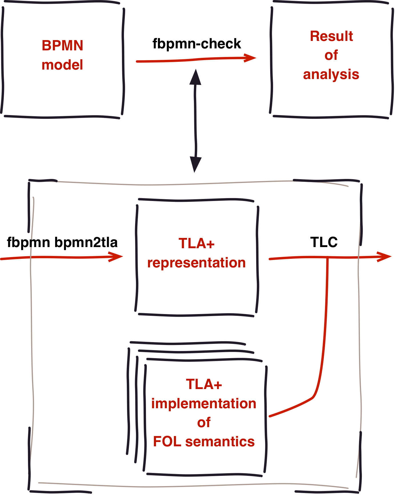

# fbpmn

[](https://travis-ci.org/pascalpoizat/fbpmn)
[](https://ci.appveyor.com/project/pascalpoizat/fbpmn)
[](https://coveralls.io/github/pascalpoizat/fbpmn)
[](LICENSE)
[](fbpmn.cabal)
<br/>
[](https://waffle.io/pascalpoizat/fbpmn)

<!--
<br/>
[](https://hackage.haskell.org/package/fbpmn)
[](http://stackage.org/lts/package/fbpmn)
[](http://stackage.org/nightly/package/fbpmn)
-->

formal tools for BPMN

## Requisites

You will need to have `git` installed on your machine to get the source code. See [here](https://git-scm.com/downloads).

You will need to have `stack` installed on your machine to compile the source code (binaries are generated by CI but not saved for use). See [here](https://docs.haskellstack.org/en/stable/README/). For Windows, due to a bug (not related to fbpmn), please use:

```shell
curl -sS -ostack.zip -L --insecure https://www.stackage.org/stack/windows-x86_64
7z x stack.zip stack.exe
```

## Getting source files

```shell
git clone https://github.com/pascalpoizat/fbpmn
```

## Compiling

```shell
cd fbpmn
stack build
stack install
```

This will install the `fbpmn` command in some place that depends on your OS.
You can use `stack path --local-bin` to find out which directory it is.
Do not forget to put this directory in your command path.

## BPMN models

We are currently developping a BPMN-XML (the standard format) to BPMN-JSON (the one we use here) transformation to ease the process.
For the moment, we deal with BPMN models in a BPMN-JSON format as follows: 

```
{
  "name": "name of the process/collaboration",
  "messages": [ list of messages names (strings) ],
  "nodes": [ list of node ids (strings) ],
  "edges": [ list of edge ids (strings) ],
  "nameN": {},
  "catN": { couples id : type (both strings), giving node categories, should be defined for each node },
  "catE": { couples id : type (both strings), giving edge categories, should be defined for each edge },
  "sourceE": { couples edge id : node id, giving sources of edges, should be defined for each edge },
  "targetE": { couples edge id : node id, giving targets of edges, should be defined for each edge },
  "messageE": { couples edge id : message name, should be defined for each message flow edge }, 
  "containN": { map pool name : list of node ids, where pool name should be in nodes, giving direct containment relation for nodes },
  "containE": { map pool name : list of edge ids, where pool name should be in nodes, giving direct containment relation for edges },
}
```

Node categories are:

```
SubProcess | Process |
AbstractTask | 
SendTask | ReceiveTask | ThrowMessageIntermediateEvent | CatchMessageIntermediateEvent | 
XorGateway | OrGateway | AndGateway | EventBasedGateway |
NoneStartEvent | MessageStartEvent | NoneEndEvent | TerminateEndEvent | MessageEndEvent
```

Edge categories are:

```
NormalSequenceFlow | ConditionalSequenceFlow | DefaultSequenceFlow | MessageFlow
```

Examples of models are given here: [models/json-origin](models/json-origin).

## Verification using TLA+

This is achieved in two steps.



### Generating the TLA+ representation of a BPMN model

To transform a BPMN collaboration model (in our JSON format) into TLA+ for verification, run:

```shell
fbpmn json2tla source-file-without-json-suffix
```

The generated TLA+ file will be saved in the same directory as the input file.
`fbpmn` also has a REPL mode (run it using `fbpmn repl`) including the following commands (**subject to evolution**):

```
quit (quit REPL)
load (load current graph from JSON and verify file)
json (save current graph as JSON)
tla  (save current graph as TLA+)
```

In the REPL you have to specify the full name of the files (including the `.json` or `.tla` suffix), and you can chose to generate the TLA+ representation of a collaboration in the directory you want.

### Verification

For verification you will need:

- the TLA+ tools, get file `tla2tools.jar` from: [https://github.com/tlaplus/tlaplus/releases](https://github.com/tlaplus/tlaplus/releases)
- the TLA+ implementation of our FOL semantics: [theories/tla](theories/tla).

1. create a directory
2. copy files from `theories/tla` into it
3. copy the file generated by `fbpmn` into it
4. 
