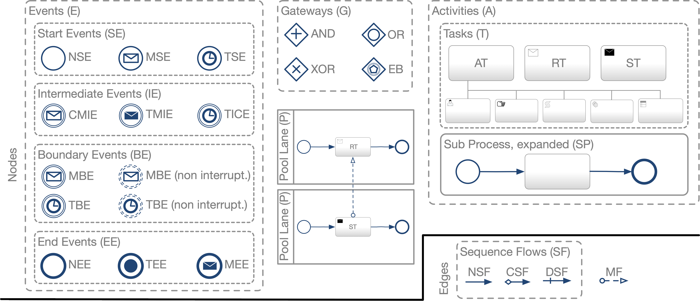

# fbpmn

[](https://travis-ci.org/pascalpoizat/fbpmn)
[](https://ci.appveyor.com/project/pascalpoizat/fbpmn)
[](https://coveralls.io/github/pascalpoizat/fbpmn)
[](LICENSE)
[](fbpmn.cabal)
<br/>
[](https://waffle.io/pascalpoizat/fbpmn)

<!--
<br/>
[](https://hackage.haskell.org/package/fbpmn)
[](http://stackage.org/lts/package/fbpmn)
[](http://stackage.org/nightly/package/fbpmn)
-->

formal tools for BPMN

## Requisites

You will need `stack` to compile the source code. See [here](https://docs.haskellstack.org/en/stable/README/).

For Windows, due to a bug (not related to fbpmn), please use:

```shell
curl -sS -ostack.zip -L --insecure https://www.stackage.org/stack/windows-x86_64
7z x stack.zip stack.exe
```

## Getting source files

You can get the source code from [the fbpmn repository](https://github.com/pascalpoizat/fbpmn) by clicking the "Clone or download" button.

You can also use the `git` command (see [here](https://git-scm.com/downloads) to get it) as follows:

```shell
git clone https://github.com/pascalpoizat/fbpmn
```

## Compiling

```shell
cd fbpmn
stack build
stack install
```

This will install the `fbpmn` command in some place that depends on your OS.
You can use `stack path --local-bin` to find out which directory it is.
Do not forget to put this directory in your command path.

## BPMN models

`fbpmn` is able to deal with **collaborations** either in BPMN or in its own JSON format. Please note that you can also deal with a standalone **process model** (workflow) as soon as you put it in a standalone pool lane (we have some examples of this [here](models/bpmn-origin/src)).

### BPMN format

Please see [the BPMN 2.0 standard](https://www.omg.org/spec/BPMN/2.0/).

The subset of BPMN that we support is presented in Figure 1.


*Figure 1: supported subset of the BPMN notation.*

`fbpmn` has been tested with models made with the Camunda Modeler, which you can get [here](https://camunda.com/products/modeler/).

### JSON format

Please note that the JSON format for a model can be generated from the BPMN format of it, using `fbpmn`.
In general, there should therefore be no need to write out models in the JSON format manually.

Our JSON format is as follows: 

```
{
  "name": "name of the process/collaboration",
  "messages": [ list of messages names (strings) ],
  "nodes": [ list of node ids (strings) ],
  "edges": [ list of edge ids (strings) ],
  "nameN": {},
  "catN": { couples id : type (both strings), giving node categories, should be defined for each node },
  "catE": { couples id : type (both strings), giving edge categories, should be defined for each edge },
  "sourceE": { couples edge id : node id, giving sources of edges, should be defined for each edge },
  "targetE": { couples edge id : node id, giving targets of edges, should be defined for each edge },
  "messageE": { couples edge id : message name, should be defined for each message flow edge }, 
  "containN": { map pool name : list of node ids, where pool name should be in nodes, giving direct containment relation for nodes },
  "containE": { map pool name : list of edge ids, where pool name should be in nodes, giving direct containment relation for edges },
}
```

Node categories are:

```
SubProcess | Process |
AbstractTask | 
SendTask | ReceiveTask | ThrowMessageIntermediateEvent | CatchMessageIntermediateEvent | 
XorGateway | OrGateway | AndGateway | EventBasedGateway |
NoneStartEvent | MessageStartEvent | NoneEndEvent | TerminateEndEvent | MessageEndEvent
```

Please note that some kinds of BPMN tasks are treated as `AbstractTask`s in the semantics.
If you have manual tasks, user tasks, service tasks, script tasks, or business rule tasks, you may use directly `AbstractTask` in your JSON model.

Edge categories are:

```
NormalSequenceFlow | ConditionalSequenceFlow | DefaultSequenceFlow | MessageFlow
```

Examples of models are given [here](models/bpmn-origin/json_from_bpmn) for files generated from BPMN, and [here](models/json-origin) for files created manually.

To help in writing the JSON format, `fbpmn` has a very basic output to the format of the `dot` command ([graphviz format](https://graphviz.org)).
To transform a JSON file into DOT, run:

```shell
fbpmn json2dot sourcefile targetfile
```

where neither `sourcefile` nor `targetfile` have a suffix (the correct ones will be added by `fbpmn`).
Then provided you have `dot` installed, you can generate a picture for your collaboration, using:

```shell
dot -Tpng sourcefile.dot -o targetfile.png
```

## Verification using TLA+

This is achieved in two steps (see Figure 2):

1. generate a TLA+ representation of the BPMN collaboration
2. use this representation and the TLA+ implementation of our FOL semantics for BPMN collaborations to perform verification (using the `tlc` model checker from the TLA+ tool box).


*Figure 2: `fbpmn` approach to the verification of BPMN collaborations.*

### Generating the TLA+ representation of a BPMN model

To transform a BPMN collaboration model into TLA+ for verification, run:

```shell
fbpmn bpmn2tla sourcefile targetfile
```

where neither `sourcefile` nor `targetfile` have a suffix (the correct ones will be added by `fbpmn`).
`fbpmn` also has a REPL mode (run it using `fbpmn repl`) including the following commands (**subject to evolution**):

```
quit (quit REPL)
help (list commands)
load (load current graph from JSON and verify file)
bpmn (load current graph from BPMN)
json (save current graph to JSON)
dot  (save current graph to DOT)
tla  (save current graph to TLA+)
```

In the REPL you have to specify the full name of the files (including the `.json` or `.tla` suffix).

### Verification

For verification you will need:

- the TLA+ tools, get file `tla2tools.jar` from: [https://github.com/tlaplus/tlaplus/releases](https://github.com/tlaplus/tlaplus/releases)
- the TLA+ implementation of our FOL semantics: [theories/tla](theories/tla).

1. create a directory
2. copy files from `theories/tla` into it
3. copy the file generated by `fbpmn` into it
4. **to be completed**
