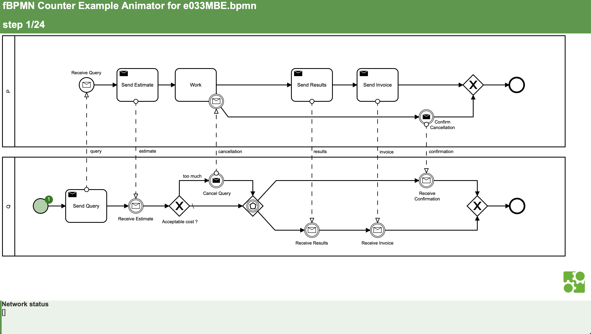
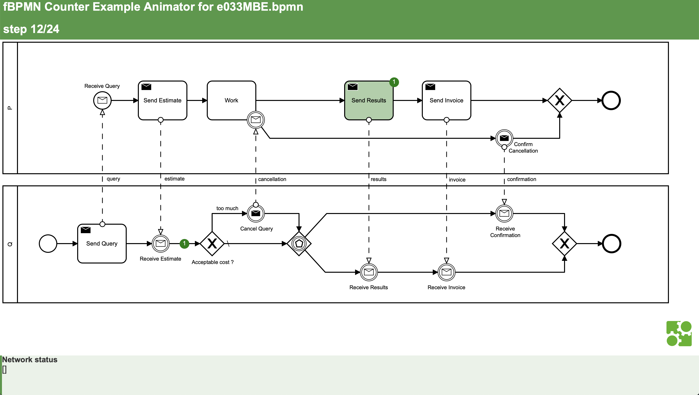
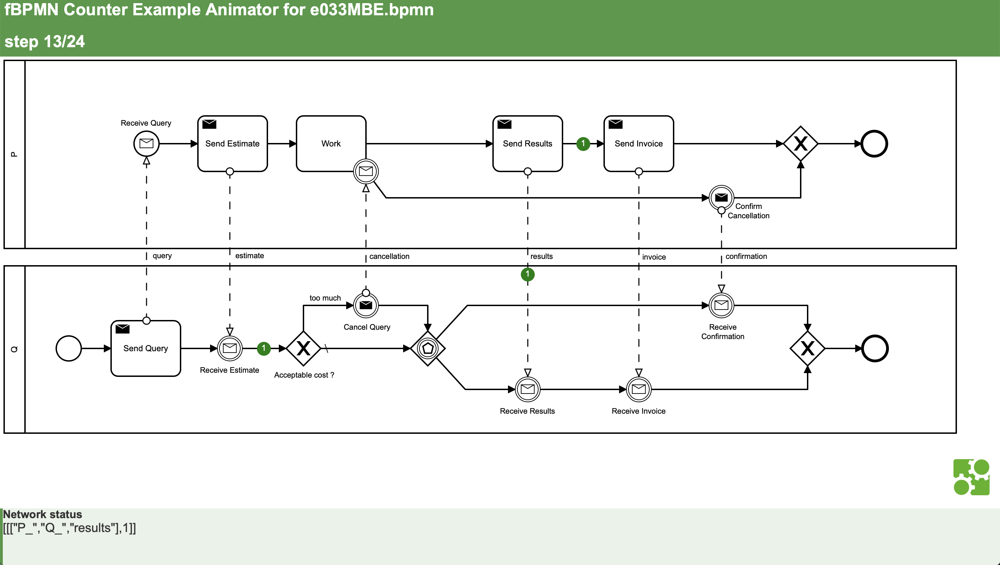
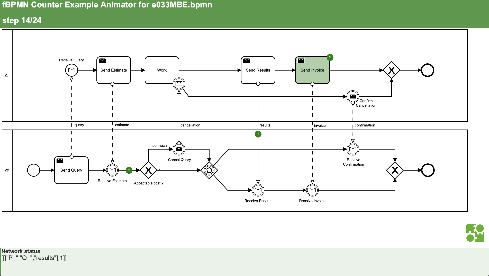

# fbpmn

[](https://travis-ci.org/pascalpoizat/fbpmn)
[](https://ci.appveyor.com/project/pascalpoizat/fbpmn)
[](LICENSE)
[](fbpmn.cabal)
<!--
<br/>
[](https://waffle.io/pascalpoizat/fbpmn)
-->
<!--
[](https://coveralls.io/github/pascalpoizat/fbpmn)
-->
<!--
<br/>
[](https://hackage.haskell.org/package/fbpmn)
[](http://stackage.org/lts/package/fbpmn)
[](http://stackage.org/nightly/package/fbpmn)
-->

**formal tools for BPMN**

`fbpmn` supports the verification of business processes (workflows and collaborations) properties:

- option to complete
- proper completion
- no dead activity
- safety
- soundness
- message-relaxed soundness

for six different communication semantics:

- unordered (bag of messages)
- fifo between each couple of processes (array of queues)
- fifo inbox (input queue at each process where messages are added)
- fifo outbox (output queue at each process where messages are fetched)
- global fifo (unique shared queue)
- RSC (realizable with synchronous communication)

**New properties and communication semantics can be easily taken into account** (see Sect. 5, *Extending the verification*).


*Figure 1: variations and properties (network unordered semantics).*

### TL;DR for the impatient

1. use the modeler of your choice to model a process or a collaboration
	
	
2. verify your model for all combinations of property and communication semantics

	```sh
	❯ fbpmn-check $FBPMN_HOME/models/bpmn-origin/src/e033MBE.bpmn 2
	Working in /tmp/e033MBE.T07y4 with 2 worker(s)
	transformation done
	<<"Processes=", 2, "Nodes=", 22, "Gateway=", 4, "SF=", 20, "MF=", 6>>
	---------- Network01Bag ----------
	[X] Prop01Type
	     states=102 trans=170 depth=24
	[X] Prop02Safe
	     states=102 trans=170 depth=24
	[ ] Prop03Sound
	     states=102 trans=170 depth=
	[X] Prop04MsgSound
	     states=102 trans=170 depth=24
	[... other communication semantics ...]
	done.
	```

3. generate interactive counter example exploration pages for all `fbpmn-check` analysis log files

	```sh
	❯ (cd /tmp/e033MBE.T07y4; fbpmn-logs2html)
	transformation done
	transformation done
	transformation done
	[...]
	```
	
4. open one of the generated files with a browser and play with the counter example using &leftarrow;/&rightarrow;/`Shift`&leftarrow;/`Shift`&rightarrow; on your keyboard

	
	
	| 01 |...| 12 | 13 | 14 |...| 24 |
	|:----------:|:-:|:----------:|:----------:|:----------:|:-:|:----------:|
	|  | |  |  |  |  |  |

	**note:** for security issues, and since the interactive counter example exploration pages load local files (your BPMN models), you will have either to:
	
	- (preferred) serve the pages using a server such as [http-server](https://www.npmjs.com/package/http-server) or [SimpleHTTPServer](https://docs.python.org/2/library/simplehttpserver.html).

		```sh
		❯ npm install -g http-server # run only once to install http-server
		❯ (cd /tmp/e033MBE.T07y4; http-server .) 
		```
		
		```sh
		❯ (cd /tmp/e033MBE.T07y4; python2 -m SimpleHTTPServer 8080) # for Python 2
		❯ (cd /tmp/e033MBE.T07y4; python3 -m http.server 8080) # for Python 3
		```
				
	- (not recommended) de-activate local file restrictions, see [here](https://github.com/mrdoob/three.js/wiki/How-to-run-things-locally).
		
## 1. Requisites

To verify your BPMN models, you will need:

- 1.1. A Java SE Development Kit (JDK 8), get it [here](https://www.oracle.com/technetwork/java/javase/downloads/jdk8-downloads-2133151.html).

	There is an issue (wrt. `tla2tools.jar`) with version 11 so you will need to install version 8. 
- 1.2. The TLA+ tools, get `tla2tools.jar` [here](https://github.com/tlaplus/tlaplus/releases).
	
If you build `fbpmn` from sources (which is required only for **Windows**), you will also need:

- 2.1. The `stack` build system for Haskell, see [here](https://docs.haskellstack.org/en/stable/README/).

	Under **Windows**, due to a bug, please use:
	
	```shell
	curl -sS -ostack.zip -L --insecure https://www.stackage.org/stack/windows-x86_64
	7z x stack.zip stack.exe
	```

## 2. Getting source files

Required for **all platforms** to get the TLA+ theories that are used in the verification process.

You can get the source files in either way:

- 2a. as an archive from [the fbpmn repository](https://github.com/pascalpoizat/fbpmn) by clicking the "Clone or download" button.

- 2b. by cloning the repository using the `git` command.

	```shell
	git clone https://github.com/pascalpoizat/fbpmn
	```

Please then set the `FBPMN_HOME` environment variable to the place where the fbpmn sources have been installed.

```sh
export FBPMN_HOME=/Somewhere/On/Your/Disk/fbpmn
```

You may typically add such a command in your shell configuration file, e.g., `~/.bashrc` or `~/.zshenv` under **Linux** and **OSX**.

## 3a. Getting a pre-built `fbpmn` binary

**Linux** and **OSX** binaries of stable versions of `fbpmn` are built using the continous integration server and are available [here](https://github.com/pascalpoizat/fbpmn/releases).

*We are working on having binaries automatically built for Windows.*

Please then put the `fbpmn` command in a directory that is in your `PATH` environment variable.

## 3b. Building `fbpmn` from source

Required for **Windows**.

```shell
cd fbpmn
stack clean
stack build
stack install
```

This will install the `fbpmn` command in some place that depends on your OS.
You can use `stack path --local-bin` to find out which directory it is.

Please then put this directory in your `PATH` environment variable.

## 4. BPMN models

`fbpmn` is able to deal with **collaborations** either in BPMN or in its own JSON format (see Sect. 7, below). Please note that you can also deal with a standalone **process model** (workflow) as soon as you put it in a standalone pool lane (see some examples of this [here](models/bpmn-origin/src)).

### BPMN format

Please see [the BPMN 2.0 standard](https://www.omg.org/spec/BPMN/2.0/).

The subset of BPMN that we support is presented in Fig. 2.


*Figure 2: supported subset of the BPMN notation.*

`fbpmn` has been tested with models made with the Camunda Modeler, which you can get [here](https://camunda.com/products/modeler/).

## 5. Verification using TLA+

### Requirements

Verification requires that:

- `FBPMN_HOME` is set to the place where the `fbpmn` sources have been installed (see Sect. 2).
- `TLA2TOOLS_HOME` is set to the place where `tla2tools.jar` is installed (see Sect. 1).
- `fbpmn` is found on the command `PATH` (see Sect. 3a/3b).
- (**optional, available for Linux and OSX only**) `fbpmn-check` and `fbpmn-logs2dot` (from the `scripts` directory of the source distribution) are found on the command `PATH`.<br/> 

### Principles

Verification is achieved in two steps (see Fig. 3):

1. generate a TLA+ representation of the BPMN collaboration
2. use this representation and the TLA+ implementation of our FOL semantics for BPMN collaborations to perform verification (using the `TLC` model checker from the TLA+ tool box).

<br/>
*Figure 3: `fbpmn` approach to the verification of BPMN collaborations.*

In the sequel, we will use the model in Fig. 4.


*Figure 4: example collaboration model (`e033MBE.bpmn`).*

**For Linux and OSX users**, we provide you with a `fbpmn-check` script (in the `scripts` directory of the source distribution) that does the two steps described in Fig. 3 for you and performs verification for each possible communication model.

```sh
❯ fbpmn-check $FBPMN_HOME/models/bpmn-origin/src/e033MBE.bpmn 2
Working in /tmp/e033MBE.T07y4 with 2 worker(s)
transformation done
<<"Processes=", 2, "Nodes=", 22, "Gateway=", 4, "SF=", 20, "MF=", 6>>
---------- Network01Bag ----------
[X] Prop01Type
     states=102 trans=170 depth=24
[X] Prop02Safe
     states=102 trans=170 depth=24
[ ] Prop03Sound
     states=102 trans=170 depth=
[X] Prop04MsgSound
     states=102 trans=170 depth=24
---------- Network02FifoPair ----------
[X] Prop01Type
     states=102 trans=170 depth=24
[X] Prop02Safe
     states=102 trans=170 depth=24
[ ] Prop03Sound
     states=102 trans=170 depth=
[X] Prop04MsgSound
     states=102 trans=170 depth=24
---------- Network04Inbox ----------
[X] Prop01Type
     states=102 trans=170 depth=24
[X] Prop02Safe
     states=102 trans=170 depth=24
[ ] Prop03Sound
     states=102 trans=170 depth=
[X] Prop04MsgSound
     states=102 trans=170 depth=24
---------- Network05Outbox ----------
[X] Prop01Type
     states=102 trans=170 depth=24
[X] Prop02Safe
     states=102 trans=170 depth=24
[ ] Prop03Sound
     states=102 trans=170 depth=
[X] Prop04MsgSound
     states=102 trans=170 depth=24
---------- Network06Fifo ----------
[X] Prop01Type
     states=121 trans=195 depth=24
[X] Prop02Safe
     states=121 trans=195 depth=24
[ ] Prop03Sound
     states=121 trans=195 depth=
[ ] Prop04MsgSound
     states=121 trans=195 depth=
---------- Network07RSC ----------
[X] Prop01Type
     states=61 trans=93 depth=21
[X] Prop02Safe
     states=61 trans=93 depth=21
[ ] Prop03Sound
     states=61 trans=93 depth=
[ ] Prop04MsgSound
     states=61 trans=93 depth=
done.
```

**For Windows users**

*We are working on providing support for Windows users too.*

### Analysing counter-examples

When a model is analysed, counter-examples are generated for each property that does not yield.

**For Linux and OSX users**, using `fbpmn-check`, the counter examples are in `.log` files that are generated in the directory of analysis, e.g., in `/tmp/e033MBE.T07y4` in the example above.

```sh
❯ (cd /tmp/e033MBE.T07y4; ls *.log)
e033MBE.Network01Bag.Prop01Type.log          e033MBE.Network05Outbox.Prop01Type.log
e033MBE.Network01Bag.Prop02Safe.log          e033MBE.Network05Outbox.Prop02Safe.log
e033MBE.Network01Bag.Prop03Sound.log         e033MBE.Network05Outbox.Prop03Sound.log
e033MBE.Network01Bag.Prop04MsgSound.log      e033MBE.Network05Outbox.Prop04MsgSound.log
e033MBE.Network02FifoPair.Prop01Type.log     e033MBE.Network06Fifo.Prop01Type.log
e033MBE.Network02FifoPair.Prop02Safe.log     e033MBE.Network06Fifo.Prop02Safe.log
e033MBE.Network02FifoPair.Prop03Sound.log    e033MBE.Network06Fifo.Prop03Sound.log
e033MBE.Network02FifoPair.Prop04MsgSound.log e033MBE.Network06Fifo.Prop04MsgSound.log
e033MBE.Network04Inbox.Prop01Type.log        e033MBE.Network07RSC.Prop01Type.log
e033MBE.Network04Inbox.Prop02Safe.log        e033MBE.Network07RSC.Prop02Safe.log
e033MBE.Network04Inbox.Prop03Sound.log       e033MBE.Network07RSC.Prop03Sound.log
e033MBE.Network04Inbox.Prop04MsgSound.log    e033MBE.Network07RSC.Prop04MsgSound.log
``` 

These files include information about the computation time and the counter-examples themselves in a verbose mode.

```sh
[...]
State 13: <Action line 156, col 1 to line 156, col 21 of module e033MBE>
/\ edgemarks = [MessageFlow_0qo10kt |-> 0, MessageFlow_1a8bsa8 |-> 0, MessageFlow_1r7fyxg |-> 0, MessageFlow_091cszi |-> 0, MessageFlow_1tq79cn |-> 1, MessageFlow_1okf1vd |-> 0, SequenceFlow_0nps006 |-> 0, SequenceFlow_1wtnl4z |-> 0, SequenceFlow_0o5vg8x |-> 0, SequenceFlow_0fplzau |-> 1, SequenceFlow_1dte0vc |-> 0, SequenceFlow_0k086s0 |-> 0, SequenceFlow_0698suh |-> 0, SequenceFlow_1wgoun9 |-> 0, SequenceFlow_16ovyt7 |-> 0, SequenceFlow_0mgjt9y |-> 0, SequenceFlow_1xvdo11 |-> 1, SequenceFlow_1y1oo45 |-> 0, SequenceFlow_0rjtib7 |-> 0, SequenceFlow_0k02j79 |-> 0, SequenceFlow_0f0ojke |-> 0, SequenceFlow_1oxapbj |-> 0, SequenceFlow_096ubuj |-> 0, SequenceFlow_0eej3d6 |-> 0, SequenceFlow_0jq12xx |-> 0, SequenceFlow_0v4m6o8 |-> 0]
/\ net = (<<"P_id", "Q_id", "results">> :> 1)
/\ nodemarks = [P_id |-> 1, StartEvent_1 |-> 0, Task_05seu1l |-> 0, Task_0yk02ke |-> 0, BoundaryEvent_1fgc3dg |-> 0, EndEvent_1yasgxk |-> 0, ExclusiveGateway_06st2fh |-> 0, IntermediateThrowEvent_16df5b4 |-> 0, Task_1lnz72e |-> 0, Task_1ypg0u2 |-> 0, Q_id |-> 1, StartEvent_1axpofs |-> 0, Task_0k7ip70 |-> 0, IntermediateThrowEvent_0yo36nb |-> 0, ExclusiveGateway_0phbzc0 |-> 0, IntermediateThrowEvent_1ewiw3i |-> 0, ExclusiveGateway_14e5fg8 |-> 0, IntermediateThrowEvent_0nfi6to |-> 0, EndEvent_0l9fmhf |-> 0, ExclusiveGateway_06aycf0 |-> 0, IntermediateThrowEvent_1s2ehzf |-> 0, IntermediateThrowEvent_1q2mw0e |-> 0]
[...]
```

To generate versions of the counter-examples that are **easier to analyse** you can use:

- `fbpmn log2json` to get a JSON version of the counter-example

	```sh
	❯ fbpmn log2json /tmp/e033MBE.T07y4/e033MBE.Network01Bag.Prop03Sound /tmp/e033MBE.T07y4/e033MBE.Network01Bag.Prop03Sound
	transformation done
	```

- `fbpmn log2dot` to get a graph version of the counter example in the format of the `dot` command ([see here](https://graphviz.org)) and then use this command to generate PDF or PNG images.

	```sh
	❯ fbpmn log2dot /tmp/e033MBE.T07y4/e033MBE.Network01Bag.Prop03Sound /tmp/e033MBE.T07y4/e033MBE.Network01Bag.Prop03Sound
	transformation done
	❯ dot -Tpdf -o /tmp/e033MBE.T07y4/e033MBE.Network01Bag.Prop03Sound.pdf /tmp/e033MBE.T07y4/e033MBE.Network01Bag.Prop03Sound.dot
	```
	
- `fbpmn log2html` to generate an interactive counter example exploration page (use the &leftarrow;/&rightarrow; keys to navigate between states of the counter example, in combination with the `Shift`key to go the the start/end of the counter example).

	```sh
	❯ fbpmn log2html /tmp/e033MBE.T07y4/e033MBE.Network01Bag.Prop03Sound /tmp/e033MBE.T07y4/e033MBE.Network01Bag.Prop03Sound
	transformation done
	```

	An excerpt of a counter example for the model in Fig. 4 is given in Fig. 5.

	[](e033MBE.Network01Bag.Prop03Sound.html)

	*Figure 5: last state of the animation of the counter example for soundness of the model in Fig. 4 with network unordered semantics.*
	
The first parameter of the three commands is the source `.log` file and the second one is the target `.json`/`.dot`/`.html` file (no sufixes in both cases, `fbpmn` adds them given the type of the read/generated file).

In all three cases, the counter-examples are filtered of the markings that are null.

To perform these transformations **for all `.log` files contained in the current directory**,
we provide you with three scripts (in the `scripts` directory of the source distribution):
`fbpmn-logs2json`,
`fbpmn-logs2dot`, and 
`fbpmn-logs2html`.

```sh
❯ (cd /tmp/e033MBE.T07y4; fbpmn-logs2html)
transformation done
transformation done
transformation done
[...]
```

**For Windows users**

*We are working on providing support for Windows users too.*

### Verification constraints

Some models are unbounded (see *e.g.*, models `e004` to `e006` [here](models/bpmn-origin/src)). To be able to check these models, you may add constraints to the verification process. For this, given your model is in file `myModel.bpmn`, create a file `myModel.constraint` of the form:

```tla
CONSTANT ConstraintNode <- <ConstraintOnNodes>
         ConstraintEdge <- <ConstraintOnEdges>
         Constraint <- <Overall constraint defined in termes of ConstraintNode and ConstraintEdge>
```

The available constraints that you can reuse are defined [here](theories/tla/PWSConstraints.tla) are can be extended.

For example, for model `e006` we may use:

```tla
CONSTANT ConstraintNode <- TRUE
         ConstraintEdge <- MaxEdgeMarking2
         Constraint <- ConstraintNodeEdge
```

that states
that node markings (the maximum number of tokens authorized on a node) is not constrained, 
that edge markings (the maximum number of tokens authorized on an edge) is 2, and
that the overall constraint is to have both the constraint on nodes and the constraint on edges.

### Extending the verification

To add a **new communication model**:

1. define your new communication model semantics, say `MyNet`, in a `NetworkMyNet.tla` file in `$FBPMN_HOME/theories/tla/`
2. copy one of the files in `$FBPMN_HOME/theories/tla/Configs/` to a new file `NetworkNNMyNet.tla` in the same directory, with `NN` being a number different from the existing communication models there
3. in the contents of `NetworkNNMyNet.tla` change the line of the network implementation definition to refer to your new communication model as defined in step 1.

```tla
LOCAL NetworkImpl == INSTANCE NetworkMyNet
```

To add a **new property to verify**:

1. define your new property, say `MyProperty`,  at the end of the `PWSSemantics.tla` file in `$FBPMN_HOME/theories/tla`
2. create a new file `PropNNMyProperty.cfg` in `$FBPMN_HOME/theories/tla/Configs`, with `NN` being a number different from the existing properties there
3. in the contents of `PropNNMyProperty.cfg` refer to your property name as defined in step 1.

```tla
\* run with -deadlock
SPECIFICATION Spec
INVARIANT TypeInvariant

PROPERTY
  MyProperty
```

## 6. Help with `fbpmn`

To get help with `fbpmn`, run `fbpmn -h`.

```sh
❯ fbpmn -h
0.2.9

Usage: fbpmn COMMAND
  formal transformations for BPMN models

Available options:
  -h,--help                Show this help text

Available commands:
  version                  prints the version
  repl                     launches the REPL
  json2dot                 transforms a collaboration from JSON to DOT
  json2tla                 transforms a collaboration from JSON to TLA+
  bpmn2json                transforms a collaboration from BPMN to JSON
  bpmn2tla                 transforms a collaboration from BPMN to TLA+
  log2json                 transforms a TLA+ log from LOG to JSON
  log2dot                  transforms a TLA+ log from LOG to DOT
  log2html                 transforms a TLA+ log from LOG to HTML
```

But for the `version`and `repl` commands, you must provide two arguments: the source file and the target file for the transformation.

**No suffixes are to be given for source/target files when running `fbpmn`.**

## 7. JSON format

The JSON format for a model can be generated from the BPMN format of it, using `fbpmn bpmn2json`.
In general, there should therefore be no need to write out models in the JSON format manually.

Examples of models are given [here](models/bpmn-origin/json_from_bpmn) for files generated from BPMN.

To help in writing the JSON format, `fbpmn` has a very basic output to the format of the `dot` command ([see here](https://graphviz.org)).
To transform a JSON file into DOT, run:

```shell
fbpmn json2dot sourcefile targetfile
```

where neither `sourcefile` nor `targetfile` have a suffix (the correct ones will be added by `fbpmn`).
Then provided you have `dot` installed, you can generate a PNG picture for your collaboration, using:

```shell
dot -Tpng sourcefile.dot -o targetfile.png
```

